# 🎬 **YOOM VIDEO CONFERENCING APP - COMPLETE MASTER GUIDE**

> **The Ultimate Reference for Everything YOOM**
>
> This comprehensive guide covers every feature, flow, component, integration, and technical detail of your video conferencing application.

---

## 📋 **TABLE OF CONTENTS**

1. [🏗️ System Architecture Overview](#system-architecture-overview)
2. [🔐 Authentication System (Clerk)](#authentication-system-clerk)
3. [🎬 Stream Video Integration](#stream-video-integration)
4. [🧩 Component Architecture](#component-architecture)
5. [🎯 Meeting Features & Flows](#meeting-features--flows)
6. [📊 Data Flow & API Integration](#data-flow--api-integration)
7. [🎨 UI/UX Features](#uiux-features)
8. [📱 Responsive Design](#responsive-design)
9. [🔄 Complete User Journeys](#complete-user-journeys)
10. [🛠️ Technical Implementation Details](#technical-implementation-details)
11. [📝 Code Examples & Patterns](#code-examples--patterns)
12. [🚀 Advanced Features](#advanced-features)

---

## 🏗️ **SYSTEM ARCHITECTURE OVERVIEW**

### **📊 High-Level Architecture Diagram**


### **🔗 Integration Flow**

```
User Authentication (Clerk) ←→ Video Services (Stream) ←→ UI Components (React)
            ↓                           ↓                        ↓
    User Management              Video Infrastructure      User Interface
    Session Handling             Call Management           Responsive Design
    Route Protection             Recording Features        Toast Notifications
```

---

## 🔐 **AUTHENTICATION SYSTEM (CLERK)**

### **📁 File Structure**

```
Authentication Files:
├── middleware.ts                    # Route protection middleware
├── app/layout.tsx                   # ClerkProvider wrapper
├── app/(auth)/sign-in/[[...sign-in]]/page.tsx
├── app/(auth)/sign-up/[[...sign-up]]/page.tsx
└── components/NavBar.tsx            # SignedIn, UserButton components
```

### **🛡️ Middleware Protection System**

**File: `middleware.ts`**

```typescript
import { clerkMiddleware, createRouteMatcher } from "@clerk/nextjs/server";

const protectedRoute = createRouteMatcher([
  "/", // Home dashboard
  "/upcoming", // Upcoming meetings
  "/meeting(.*)", // All meeting routes (catch-all)
  "/previous", // Previous meetings
  "/recordings", // Meeting recordings
  "/personal-room", // Personal meeting room
]);

export default clerkMiddleware((auth, req) => {
  if (protectedRoute(req)) auth().protect();
});

export const config = {
  matcher: [
    "/((?!.+\\.[\\w]+$|_next).*)", // All routes except files and _next
    "/", // Root
    "/(api|trpc)(.*)", // API routes
  ],
};
```

### **🔄 Authentication Flow**


### **👤 User Management Features**

1. **🔑 Sign In/Sign Up**
   - Email/password authentication
   - Social login options (configurable)
   - Automatic user profile creation

2. **🖼️ User Profile Integration**
   - Profile pictures from Clerk → Stream avatars
   - Username mapping: Clerk → Stream user identity
   - Seamless identity across both systems

3. **🔒 Session Management**
   - Automatic token refresh
   - Secure logout with cleanup
   - Route-based access control

### **🎯 Key Integration Points**

**Clerk → Stream User Mapping:**

```typescript
// In StreamVideoProvider
user: {
  id: user?.id,           // Clerk ID becomes Stream ID
  name: user?.username || user?.id,
  image: user?.imageUrl,  // Profile sync
}
```

---

## 🎬 **STREAM VIDEO INTEGRATION**

### **📁 Stream Integration Files**

```
Stream Integration:
├── providers/StreamClientProvider.tsx    # Main provider component
├── actions/stream.actions.ts             # Server-side token generation
├── hooks/useGetCalls.ts                  # Call querying hook
├── hooks/useGetCallById.ts               # Individual call retrieval
└── app/(root)/meeting/[id]/page.tsx      # Meeting room page
```

### **🏭 StreamClientProvider Architecture**

**File: `providers/StreamClientProvider.tsx`**

```typescript
'use client';

import { ReactNode, useEffect, useState } from 'react';
import { StreamVideoClient, StreamVideo } from '@stream-io/video-react-sdk';
import { useUser } from '@clerk/nextjs';
import { tokenProvider } from '@/actions/stream.actions';

const API_KEY = process.env.NEXT_PUBLIC_STREAM_API_KEY;

const StreamVideoProvider = ({ children }: { children: ReactNode }) => {
  const [videoClient, setVideoClient] = useState<StreamVideoClient>();
  const { user, isLoaded } = useUser();

  useEffect(() => {
    if (!isLoaded || !user) return;
    if (!API_KEY) throw new Error('Stream API key is missing');

    const client = new StreamVideoClient({
      apiKey: API_KEY,
      user: {
        id: user?.id,
        name: user?.username || user?.id,
        image: user?.imageUrl,
      },
      tokenProvider,  // Server-side token generation
    });

    setVideoClient(client);
  }, [user, isLoaded]);

  if (!videoClient) return <Loader />;

  return <StreamVideo client={videoClient}>{children}</StreamVideo>;
};
```

### **🔐 Secure Token Generation**

**File: `actions/stream.actions.ts`**

```typescript
"use server";

import { currentUser } from "@clerk/nextjs/server";
import { StreamClient } from "@stream-io/node-sdk";

const STREAM_API_KEY = process.env.NEXT_PUBLIC_STREAM_API_KEY;
const STREAM_API_SECRET = process.env.STREAM_SECRET_KEY;

export const tokenProvider = async () => {
  const user = await currentUser();

  // Security validations
  if (!user) throw new Error("User is not authenticated");
  if (!STREAM_API_KEY) throw new Error("Stream API key missing");
  if (!STREAM_API_SECRET) throw new Error("Stream API secret missing");

  const streamClient = new StreamClient(STREAM_API_KEY, STREAM_API_SECRET);

  // Token with 1-hour expiration
  const expirationTime = Math.floor(Date.now() / 1000) + 3600;
  const issuedAt = Math.floor(Date.now() / 1000) - 60;

  const token = streamClient.createToken(user.id, expirationTime, issuedAt);
  return token;
};
```

### **🎥 Video Call Infrastructure**

**Call Management Features:**

1. **🎬 Instant Meetings** - Create and join immediately
2. **📅 Scheduled Meetings** - Plan for future dates
3. **🔗 Join via Link/ID** - Flexible joining options
4. **👤 Personal Rooms** - Permanent meeting spaces
5. **📊 Call Analytics** - Usage statistics and metrics
6. **🎥 Screen Sharing** - Desktop and application sharing
7. **💬 Chat Integration** - Text messaging during calls
8. **📹 Recording** - Capture and playback meetings

---

## 🧩 **COMPONENT ARCHITECTURE**

### **📊 Component Hierarchy Diagram**

```mermaid
graph TD
    A[RootLayout] --> B[ClerkProvider]
    B --> C[StreamVideoProvider]
    C --> D[App Components]

    D --> E[NavBar]
    D --> F[Sidebar]
    D --> G[Main Content]

    G --> H[MeetingTypeList]
    G --> I[CallList]
    G --> J[MeetingRoom]

    H --> K[HomeCard × 4]
    H --> L[MeetingModal]

    I --> M[MeetingCard]

    J --> N[MeetingSetup]
    J --> O[VideoLayout]
    J --> P[CallControls]
```



### **🎯 Key Components Breakdown**

#### **1. 📱 Navigation Components**

**NavBar (`components/NavBar.tsx`)**

```typescript
Features:
- Fixed position navbar
- YOOM logo with home link
- UserButton (Clerk component)
- MobileNav integration
- Responsive logo sizing
```

**Sidebar (`components/SideBar.tsx`)**

```typescript
Features:
- Sticky left sidebar (desktop only)
- Navigation links with active states
- Dynamic route highlighting
- Responsive visibility (hidden on mobile)
- Icon + text layout
```

**MobileNav (`components/MobileNav.tsx`)**

```typescript
Features:
- Hamburger menu (mobile only)
- Sheet-based slide-out navigation
- Same links as desktop sidebar
- Auto-close after selection
- Touch-optimized interface
```

#### **2. 🎬 Meeting Components**

**MeetingTypeList (`components/MeetingTypeList.tsx`)**

```typescript
Core Features:
- 4 main action cards (HomeCard components)
- Modal management for different meeting types
- Meeting creation logic with createMeeting()
- Link copying with enhanced UX
- State management for modal visibility

State Management:
const [meetingState, setMeetingState] = useState<
  'isScheduleMeeting' | 'isJoiningMeeting' | 'isInstantMeeting' | undefined
>(undefined);

Meeting Creation Flow:
1. Generate UUID: crypto.randomUUID()
2. Create Stream call: client.call('default', id)
3. Configure meeting: call.getOrCreate(options)
4. Handle navigation and notifications
```

**MeetingModal (`components/MeetingModal.tsx`)**

```typescript
Props Interface:
interface MeetingModalProps {
  isOpen: boolean;
  onClose: () => void;
  title: string;
  className?: string;
  children?: ReactNode;
  handleClick?: () => void;
  buttonText?: string;
  instantMeeting?: boolean;
  image?: string;
  buttonClassName?: string;
  buttonIcon?: string;
}

Features:
- Shadcn/UI Dialog-based modal
- Flexible content with children prop
- Custom button configurations
- Accessibility with DialogTitle
- Responsive design
```

#### **3. 📊 List & Card Components**

**CallList (`components/CallList.tsx`)**

```typescript
Types Supported: 'ended' | 'upcoming' | 'recordings'

Features:
- Dynamic call filtering based on type
- Recording fetch and display
- Grid layout (responsive)
- Empty state handling
- Meeting card rendering

Call Filtering Logic:
- Ended: startsAt < now OR endedAt exists
- Upcoming: startsAt > now
- Recordings: Calls with recorded content
```

**MeetingCard (`components/MeetingCard.tsx`)**

```typescript
Features:
- Meeting information display
- Action buttons (Start/Play)
- Copy link functionality
- Date/time formatting
- Responsive card design
- Icon-based visual distinction
```

#### **4. 🎥 Video Call Components**

**MeetingSetup (`components/MeetingSetup.tsx`)**

```typescript
Pre-Call Features:
- Video preview with camera test
- Microphone/camera toggle options
- Device settings configuration
- Meeting timing validation
- Join meeting action

Validation Logic:
- Call not started yet: Show waiting message
- Call ended: Show ended message
- Call active: Show setup interface
```

**MeetingRoom (`components/MeetingRoom.tsx`)**

```typescript
In-Call Features:
- Multiple layout options (Grid/Speaker layouts)
- Call controls (mute, camera, screen share)
- Participant list management
- Layout switching dropdown
- Call statistics
- End call functionality

Layout Types: 'grid' | 'speaker-left' | 'speaker-right'
```

### **🔄 Component Communication Patterns**

1. **📡 Context Providers**
   - StreamVideoProvider: Video client access
   - ClerkProvider: Authentication state
   - ToastProvider: Notification system

2. **🎣 Custom Hooks**
   - useGetCalls(): Fetch and filter calls
   - useGetCallById(): Individual call retrieval
   - useStreamVideoClient(): Access video client
   - useUser(): Clerk user information

3. **📤 Event Handling**
   - Modal state management
   - Navigation actions
   - Meeting creation/joining
   - Copy link actions

---

## 🎯 **MEETING FEATURES & FLOWS**

### **📋 Complete Meeting Type Matrix**

| Meeting Type         | Creation Method       | Access           | Duration     | Features                       |
| -------------------- | --------------------- | ---------------- | ------------ | ------------------------------ |
| **🎬 Instant**       | "New Meeting" button  | Link sharing     | Unlimited    | Immediate start, copy link     |
| **📅 Scheduled**     | Date/time picker      | Link sharing     | Timed access | Future start, advance planning |
| **🔗 Join Existing** | Meeting ID/Link input | Direct join      | Ongoing      | Enter active meetings          |
| **👤 Personal Room** | Permanent room        | Always available | Unlimited    | Fixed ID, always accessible    |

### **🎬 Instant Meeting Flow**

```mermaid
graph LR
    A[Click "New Meeting"] --> B[Modal Opens]
    B --> C[Click "Start Meeting"]
    C --> D[createMeeting() Executes]
    D --> E[Generate UUID]
    E --> F[Create Stream Call]
    F --> G[Meeting Created]
    G --> H[Show Link Copy Modal]
    H --> I[Copy Link + Share]
    I --> J[Enter Meeting Room]
```

**Technical Implementation:**

```typescript
const createMeeting = async () => {
  if (!client || !user) return;

  try {
    // Generate unique meeting ID
    const id = crypto.randomUUID();

    // Create Stream call object
    const call = client.call("default", id);
    if (!call) throw new Error("Failed to create meeting");

    // Configure meeting metadata
    const startsAt =
      values.dateTime.toISOString() || new Date(Date.now()).toISOString();
    const description = values.description || "Instant Meeting";

    // Create meeting on Stream servers
    await call.getOrCreate({
      data: {
        starts_at: startsAt,
        custom: { description },
      },
    });

    // Update local state
    setCallDetail(call);

    // Show success notification
    toast({ title: "Meeting Created" });
  } catch (error) {
    console.error(error);
    toast({ title: "Failed to create Meeting" });
  }
};
```

### **📅 Scheduled Meeting Flow**

```mermaid
graph LR
    A[Click "Schedule Meeting"] --> B[Modal with DateTime Picker]
    B --> C[Select Date/Time]
    C --> D[Add Description]
    D --> E[Click "Schedule"]
    E --> F[createMeeting() with Future Time]
    F --> G[Meeting Link Generated]
    G --> H[Copy & Share Link]
    H --> I[Appears in "Upcoming"]
```

### **🔗 Join Meeting Flow**

```mermaid
graph LR
    A[Click "Join Meeting"] --> B[Input Modal]
    B --> C[Enter Meeting ID/Link]
    C --> D[Click "Join"]
    D --> E[Navigate to Meeting]
    E --> F[Meeting Setup Screen]
    F --> G[Join Call]
```

### **👤 Personal Room Flow**

```mermaid
graph LR
    A[Visit Personal Room] --> B[Show Room Details]
    B --> C[Copy Permanent Link]
    C --> D[Share with Team]
    D --> E[Click "Start Meeting"]
    E --> F[Enter Room]
```

### **📊 Recording & Playback System**

**Recording Workflow:**

```typescript
// Automatic recording detection
useEffect(() => {
  const fetchRecordings = async () => {
    const callData = await Promise.all(
      callRecordings?.map((meeting) => meeting.queryRecordings()) ?? []
    );

    const recordings = callData
      .filter((call) => call.recordings.length > 0)
      .flatMap((call) => call.recordings);

    setRecordings(recordings);
  };

  if (type === "recordings") {
    fetchRecordings();
  }
}, [type, callRecordings]);
```

**Recording Features:**

1. **🔴 Automatic Recording** - Configurable per call
2. **📹 Playback Interface** - Stream-hosted playback
3. **📂 Recording Management** - List, filter, and access
4. **🔗 Direct Links** - Shareable recording URLs
5. **📊 Recording Metadata** - Duration, participants, timestamps

---

## 📊 **DATA FLOW & API INTEGRATION**

### **🔄 Complete Data Flow Diagram**


### **🎣 Custom Hooks System**

#### **useGetCalls Hook**

```typescript
export const useGetCalls = () => {
  const { user } = useUser();
  const client = useStreamVideoClient();
  const [calls, setCalls] = useState<Call[]>();
  const [isLoading, setIsLoading] = useState(false);

  useEffect(() => {
    const loadCalls = async () => {
      if (!client || !user?.id) return;
      setIsLoading(true);

      try {
        const { calls } = await client.queryCalls({
          sort: [{ field: "starts_at", direction: -1 }],
          filter_conditions: {
            starts_at: { $exists: true },
            $or: [
              { created_by_user_id: user.id },
              { members: { $in: [user.id] } },
            ],
          },
        });
        setCalls(calls);
      } catch (error) {
        console.error(error);
      } finally {
        setIsLoading(false);
      }
    };

    loadCalls();
  }, [client, user?.id]);

  // Smart filtering logic
  const now = new Date();

  const endedCalls = calls?.filter(({ state: { startsAt, endedAt } }) => {
    return (startsAt && new Date(startsAt) < now) || !!endedAt;
  });

  const upcomingCalls = calls?.filter(({ state: { startsAt } }) => {
    return startsAt && new Date(startsAt) > now;
  });

  return { endedCalls, upcomingCalls, callRecordings: calls, isLoading };
};
```

#### **API Query Patterns**

**Stream API Filters:**

```typescript
// Get user's calls (created or member of)
filter_conditions: {
  starts_at: { $exists: true },
  $or: [
    { created_by_user_id: user.id },     // Created by user
    { members: { $in: [user.id] } },     // User is member
  ],
}

// Sort by start time (newest first)
sort: [{ field: 'starts_at', direction: -1 }]
```

### **🔐 Security & Token Management**

**Token Lifecycle:**


**Token Security Features:**

- ⏰ **1-hour expiration** - Automatic refresh
- 🔐 **Server-side generation** - Secrets never exposed
- 👤 **User-specific tokens** - Unique per authenticated user
- 🛡️ **Validation layers** - Multiple security checks

---

## 🎨 **UI/UX FEATURES**

### **📋 Toast Notification System**

**Enhanced Copy Link Toasts:**

```typescript
// Instant Meeting Toast
toast({
  title: "🎉 Meeting Link Copied!",
  description:
    "Share this link with participants to invite them to your meeting.",
  variant: "default",
  duration: 3000,
});

// Scheduled Meeting Toast
toast({
  title: "📅 Scheduled Meeting Link Copied!",
  description:
    "Share this link with participants. They can join at the scheduled time.",
  variant: "default",
  duration: 3000,
});

// Personal Room Toast
toast({
  title: "🏠 Personal Room Link Copied!",
  description:
    "Share your personal meeting room link. This link never changes and is always available.",
  variant: "default",
  duration: 4000,
});
```

### **🎭 Animation & Interaction Design**

**Button Animations:**

```css
/* Hover & Click Effects */
.interactive-button {
  transition: all 0.2s ease;
  transform: scale(1);
}

.interactive-button:hover {
  transform: scale(1.05); /* Grow on hover */
}

.interactive-button:active {
  transform: scale(0.95); /* Shrink on click */
}
```

**Copy Button State Management:**

```typescript
const CopyLinkButton = ({ link, successTitle, successDescription }) => {
  const [copied, setCopied] = useState(false);

  const handleCopy = async () => {
    await navigator.clipboard.writeText(link);
    setCopied(true);

    // Visual feedback
    toast({ title: successTitle, description: successDescription });

    // Reset after 2 seconds
    setTimeout(() => setCopied(false), 2000);
  };

  return (
    <Button
      onClick={handleCopy}
      className={copied ? "bg-green-600 hover:bg-green-700" : ""}
      disabled={copied}
    >
      {copied ? "✅ Copied!" : "📋 Copy Link"}
    </Button>
  );
};
```

### **🎨 Theme & Styling System**

**Custom Color Palette:**

```css
:root {
  --dark-1: #1c1f2e; /* Primary dark background */
  --dark-2: #161925; /* Secondary dark */
  --dark-3: #252a41; /* Accent dark */
  --blue-1: #0e78f9; /* Primary blue */
  --sky-1: #c9ddff; /* Light blue accent */
  --orange-1: #ff742e; /* Orange accent */
  --purple-1: #830ef9; /* Purple accent */
  --yellow-1: #f9a90e; /* Yellow accent */
}
```

**Responsive Breakpoints:**

```css
/* Mobile First Approach */
.component {
  /* Mobile (default) */
  width: 100%;

  /* Tablet */
  @media (min-width: 640px) {
    width: 50%;
  }

  /* Desktop */
  @media (min-width: 1024px) {
    width: 25%;
  }
}
```

---

## 📱 **RESPONSIVE DESIGN**

### **📊 Responsive Breakpoint Strategy**

| Screen Size | Breakpoint       | Navigation      | Layout        | Features            |
| ----------- | ---------------- | --------------- | ------------- | ------------------- |
| **Mobile**  | `< 640px`        | Hamburger Menu  | Single Column | Touch-optimized     |
| **Tablet**  | `640px - 1024px` | Visible Sidebar | 2 Columns     | Hybrid interactions |
| **Desktop** | `> 1024px`       | Full Sidebar    | 4 Columns     | Full feature set    |

### **📱 Mobile-Specific Features**

**Navigation Adaptation:**

```typescript
// Sidebar (Desktop Only)
<section className="max-sm:hidden lg:w-[264px]">
  {/* Desktop sidebar content */}
</section>

// Mobile Navigation (Mobile Only)
<Image
  src="/icons/hamburger.svg"
  className="cursor-pointer sm:hidden"
  onClick={() => setMobileMenuOpen(true)}
/>
```

**Touch-Optimized Interactions:**

- **📏 Larger tap targets** - 44px minimum touch area
- **👆 Swipe gestures** - Sheet-based navigation
- **🔄 Pull-to-refresh** - Native mobile patterns
- **⚡ Fast animations** - 200ms transitions

### **💻 Desktop Enhancements**

- **⌨️ Keyboard shortcuts** - Space bar for mute, etc.
- **🖱️ Hover states** - Rich interactive feedback
- **📋 Right-click menus** - Contextual actions
- **🔍 Multi-tasking** - Picture-in-picture mode

---

## 🔄 **COMPLETE USER JOURNEYS**

### **🎬 Journey 1: Host Creates Instant Meeting**

```mermaid
graph TD
    A[User Opens App] --> B{Authenticated?}
    B -->|No| C[Redirect to Login]
    B -->|Yes| D[Dashboard Loads]
    C --> E[Clerk Authentication]
    E --> F[User Data Retrieved]
    F --> G[Stream Client Initialized]
    G --> D
    D --> H[Click "New Meeting"]
    H --> I[Modal: "Start Instant Meeting"]
    I --> J[Click "Start Meeting"]
    J --> K[createMeeting() Executes]
    K --> L[UUID Generated]
    L --> M[Stream Call Created]
    M --> N[Modal: "Meeting Ready!"]
    N --> O[Copy Link + Share]
    O --> P[Click "Start Meeting"]
    P --> Q[Enter Meeting Room]
    Q --> R[Meeting Setup Screen]
    R --> S[Join Call]
    S --> T[Active Video Call]
```

### **👥 Journey 2: Participant Joins Meeting**

```mermaid
graph TD
    A[Receive Meeting Link] --> B[Click Link]
    B --> C[App Opens/Loads]
    C --> D{Authenticated?}
    D -->|No| E[Clerk Login Process]
    D -->|Yes| F[Direct to Meeting]
    E --> F
    F --> G[Meeting Page Loads]
    G --> H[useGetCallById Hook]
    H --> I[Stream API Call]
    I --> J{Call Found?}
    J -->|No| K[Call Not Found Error]
    J -->|Yes| L[Permission Check]
    L --> M{Access Granted?}
    M -->|No| N[Access Denied Alert]
    M -->|Yes| O[Meeting Setup Screen]
    O --> P[Camera/Mic Test]
    P --> Q[Click "Join Meeting"]
    Q --> R[call.join() Executes]
    R --> S[Enter Meeting Room]
    S --> T[Active Video Call]
```

### **📅 Journey 3: Schedule Future Meeting**

```mermaid
graph TD
    A[Click "Schedule Meeting"] --> B[Modal Opens]
    B --> C[Fill Description]
    C --> D[Select Future Date/Time]
    D --> E[Click "Create Meeting"]
    E --> F[createMeeting() with Future Time]
    F --> G[Meeting Scheduled]
    G --> H["Meeting Created" Modal]
    H --> I[Copy Meeting Link]
    I --> J[Share Link with Participants]
    J --> K[Meeting Appears in "Upcoming"]
    K --> L[Wait for Scheduled Time]
    L --> M[Participants Join via Link]
    M --> N[Meeting Proceeds]
```

### **🏠 Journey 4: Use Personal Room**

```mermaid
graph TD
    A[Visit Personal Room Page] --> B[Room Details Displayed]
    B --> C[Permanent Meeting ID Shown]
    C --> D[Copy Room Link]
    D --> E[Share with Team Members]
    E --> F[Click "Start Meeting"]
    F --> G[Enter Personal Room]
    G --> H[Meeting Setup]
    H --> I[Join Personal Room]
    I --> J[Team Members Join Anytime]
    J --> K[Ongoing Team Meetings]
```

---

## 🛠️ **TECHNICAL IMPLEMENTATION DETAILS**

### **⚙️ Environment Configuration**

```bash
# Clerk Authentication
NEXT_PUBLIC_CLERK_PUBLISHABLE_KEY=pk_test_xxxxx
CLERK_SECRET_KEY=sk_test_xxxxx
NEXT_PUBLIC_CLERK_SIGN_IN_URL=/sign-in
NEXT_PUBLIC_CLERK_SIGN_UP_URL=/sign-up

# Stream Video API
NEXT_PUBLIC_STREAM_API_KEY=xxxxx          # Public - used in browser
STREAM_SECRET_KEY=xxxxx                   # Private - server only
STREAM_APP_ID=xxxxx                       # App identifier

# Application URLs
NEXT_PUBLIC_BASE_URL=http://localhost:3000 # For link generation
```

### **📦 Package Dependencies**

```json
{
  "dependencies": {
    "@clerk/nextjs": "^5.x", // Authentication
    "@stream-io/video-react-sdk": "^0.x", // Video calling
    "@stream-io/node-sdk": "^0.x", // Server SDK
    "next": "14.x", // Framework
    "react": "^18.x", // UI library
    "react-datepicker": "^4.x", // Date selection
    "@radix-ui/react-toast": "^1.x", // Notifications
    "tailwindcss": "^3.x", // Styling
    "typescript": "^5.x" // Type safety
  }
}
```

### **🏗️ Next.js App Router Structure**

```
app/
├── layout.tsx                    # Root layout with providers
├── globals.css                   # Global styles
├── (auth)/                      # Route group for auth
│   ├── sign-in/[[...sign-in]]/page.tsx
│   └── sign-up/[[...sign-up]]/page.tsx
└── (root)/                      # Route group for app
    ├── layout.tsx               # App layout with navbar/sidebar
    ├── (home)/                  # Home route group
    │   ├── layout.tsx          # Home layout
    │   ├── page.tsx            # Dashboard
    │   ├── upcoming/page.tsx   # Upcoming meetings
    │   ├── previous/page.tsx   # Previous meetings
    │   ├── recordings/page.tsx # Recording library
    │   └── personal-room/page.tsx
    └── meeting/[id]/page.tsx   # Meeting room (dynamic route)
```

### **🔒 Security Implementation**

**Route Protection Layers:**

1. **🛡️ Middleware Level** - Blocks access to protected routes
2. **🎣 Component Level** - useUser() checks in components
3. **🔐 API Level** - Server action authentication
4. **📡 Stream Level** - Token-based video access

**Token Security Flow:**

```typescript
// Client requests token
tokenProvider()
  ↓
// Server validates Clerk user
currentUser()
  ↓
// Generate Stream token with user ID
streamClient.createToken(user.id, expiry, issuedAt)
  ↓
// Return secure token to client
return token;
```

---

## 📝 **CODE EXAMPLES & PATTERNS**

### **🎯 Meeting Creation Pattern**

```typescript
// Standard meeting creation function
const createMeeting = async (type: "instant" | "scheduled") => {
  // 1. Validation
  if (!client || !user) {
    toast({ title: "Authentication required" });
    return;
  }

  // 2. Meeting configuration
  const meetingConfig = {
    id: crypto.randomUUID(),
    startsAt:
      type === "instant"
        ? new Date().toISOString()
        : values.dateTime.toISOString(),
    description: values.description || `${type} Meeting`,
  };

  try {
    // 3. Stream API call
    const call = client.call("default", meetingConfig.id);

    await call.getOrCreate({
      data: {
        starts_at: meetingConfig.startsAt,
        custom: { description: meetingConfig.description },
      },
    });

    // 4. Success handling
    setCallDetail(call);
    toast({
      title: "Meeting Created Successfully",
      description: `Your ${type} meeting is ready to join.`,
    });

    // 5. Navigation (optional)
    if (type === "instant") {
      router.push(`/meeting/${meetingConfig.id}`);
    }
  } catch (error) {
    // 6. Error handling
    console.error("Meeting creation failed:", error);
    toast({
      title: "Meeting Creation Failed",
      description: "Please try again or contact support.",
      variant: "destructive",
    });
  }
};
```

### **🎣 Custom Hook Pattern**

```typescript
// Reusable data fetching hook
export const useStreamData = <T>(
  queryFn: () => Promise<T>,
  dependencies: any[] = []
) => {
  const [data, setData] = useState<T | null>(null);
  const [loading, setLoading] = useState(true);
  const [error, setError] = useState<string | null>(null);

  useEffect(() => {
    let isMounted = true;

    const fetchData = async () => {
      try {
        setLoading(true);
        setError(null);

        const result = await queryFn();

        if (isMounted) {
          setData(result);
        }
      } catch (err) {
        if (isMounted) {
          setError(err instanceof Error ? err.message : "An error occurred");
        }
      } finally {
        if (isMounted) {
          setLoading(false);
        }
      }
    };

    fetchData();

    return () => {
      isMounted = false;
    };
  }, dependencies);

  return { data, loading, error, refetch: () => fetchData() };
};
```

### **🎨 Component Composition Pattern**

```typescript
// Flexible modal component
interface BaseModalProps {
  isOpen: boolean;
  onClose: () => void;
  title: string;
  children?: ReactNode;
}

const BaseModal = ({ isOpen, onClose, title, children }: BaseModalProps) => (
  <Dialog open={isOpen} onOpenChange={onClose}>
    <DialogContent>
      <DialogTitle>{title}</DialogTitle>
      {children}
    </DialogContent>
  </Dialog>
);

// Specialized meeting modal
const MeetingModal = (props: MeetingModalProps) => (
  <BaseModal {...props}>
    {props.image && <Image src={props.image} alt="icon" />}
    {props.children}
    <Button onClick={props.handleClick}>
      {props.buttonText || "Proceed"}
    </Button>
  </BaseModal>
);
```

---

## 🚀 **ADVANCED FEATURES**

### **🎥 Video Layout Management**

```typescript
// Dynamic layout switching
type CallLayoutType = 'grid' | 'speaker-left' | 'speaker-right';

const CallLayout = ({ layout }: { layout: CallLayoutType }) => {
  switch (layout) {
    case 'grid':
      return <PaginatedGridLayout />;
    case 'speaker-right':
      return <SpeakerLayout participantsBarPosition="left" />;
    default:
      return <SpeakerLayout participantsBarPosition="right" />;
  }
};

// Layout controls
const LayoutControls = ({ layout, setLayout }) => (
  <DropdownMenu>
    <DropdownMenuTrigger>
      <LayoutList size={20} />
    </DropdownMenuTrigger>
    <DropdownMenuContent>
      {['Grid', 'Speaker-Left', 'Speaker-Right'].map((item) => (
        <DropdownMenuItem
          key={item}
          onClick={() => setLayout(item.toLowerCase() as CallLayoutType)}
        >
          {item}
        </DropdownMenuItem>
      ))}
    </DropdownMenuContent>
  </DropdownMenu>
);
```

### **📊 Call Analytics & Monitoring**

```typescript
// Real-time call statistics
const CallStats = () => {
  const { useCallStatsReport } = useCallStateHooks();
  const statsReport = useCallStatsReport();

  return (
    <div className="stats-panel">
      <div>Participants: {statsReport?.participants?.length}</div>
      <div>Duration: {formatDuration(statsReport?.duration)}</div>
      <div>Quality: {statsReport?.quality}</div>
    </div>
  );
};

// Performance monitoring
const useCallPerformance = () => {
  const [metrics, setMetrics] = useState({
    latency: 0,
    bandwidth: 0,
    packetLoss: 0,
  });

  useEffect(() => {
    const interval = setInterval(() => {
      // Collect performance metrics
      setMetrics(getCurrentMetrics());
    }, 5000);

    return () => clearInterval(interval);
  }, []);

  return metrics;
};
```

### **🔐 Advanced Security Features**

```typescript
// Meeting access control
const validateMeetingAccess = async (callId: string, userId: string) => {
  try {
    const call = await client.call("default", callId);
    const callData = await call.get();

    // Check if user is host or member
    const isHost = callData.created_by.id === userId;
    const isMember = callData.members.some(
      (member) => member.user.id === userId
    );

    return { allowed: isHost || isMember, role: isHost ? "host" : "member" };
  } catch (error) {
    return { allowed: false, role: null };
  }
};

// Rate limiting for meeting creation
const rateLimiter = new Map<string, number[]>();

const checkRateLimit = (
  userId: string,
  limit: number = 5,
  window: number = 60000
) => {
  const now = Date.now();
  const userRequests = rateLimiter.get(userId) || [];

  // Remove old requests outside the window
  const validRequests = userRequests.filter((time) => now - time < window);

  if (validRequests.length >= limit) {
    throw new Error("Rate limit exceeded. Please try again later.");
  }

  validRequests.push(now);
  rateLimiter.set(userId, validRequests);

  return true;
};
```

### **📱 Progressive Web App Features**

```typescript
// Offline support
const useOfflineSupport = () => {
  const [isOnline, setIsOnline] = useState(navigator.onLine);

  useEffect(() => {
    const handleOnline = () => setIsOnline(true);
    const handleOffline = () => setIsOnline(false);

    window.addEventListener("online", handleOnline);
    window.addEventListener("offline", handleOffline);

    return () => {
      window.removeEventListener("online", handleOnline);
      window.removeEventListener("offline", handleOffline);
    };
  }, []);

  return isOnline;
};

// Push notifications
const usePushNotifications = () => {
  const subscribeToNotifications = async () => {
    if ("serviceWorker" in navigator && "PushManager" in window) {
      try {
        const registration = await navigator.serviceWorker.register("/sw.js");
        const subscription = await registration.pushManager.subscribe({
          userVisibleOnly: true,
          applicationServerKey: process.env.NEXT_PUBLIC_VAPID_KEY,
        });

        // Send subscription to server
        await fetch("/api/subscribe", {
          method: "POST",
          body: JSON.stringify(subscription),
        });
      } catch (error) {
        console.error("Push notification subscription failed:", error);
      }
    }
  };

  return { subscribeToNotifications };
};
```

---

## 🎉 **SUMMARY & QUICK REFERENCE**

### **🚀 What You've Built**

**YOOM is a complete, production-ready video conferencing application featuring:**

✅ **Secure Authentication** - Clerk integration with middleware protection  
✅ **Professional Video Calling** - Stream SDK with full feature set  
✅ **Multiple Meeting Types** - Instant, scheduled, join-by-link, personal rooms  
✅ **Recording & Playback** - Automatic recording with management interface  
✅ **Responsive Design** - Mobile-first with desktop enhancements  
✅ **Advanced UI/UX** - Smooth animations, toast notifications, copy functionality  
✅ **Enterprise Security** - Token-based authentication, route protection  
✅ **Scalable Architecture** - Component-based, hook-driven, maintainable code

### **📋 Quick Command Reference**

```bash
# Development
npm run dev              # Start development server
npm run build           # Build for production
npm run start           # Start production server

# Dependencies
npm install             # Install all dependencies
npm run lint            # Run ESLint
npm run type-check      # TypeScript checking

# Database & Auth
npm run clerk:sync      # Sync Clerk configuration
npm run stream:test     # Test Stream connection
```

### **🔗 Important URLs**

- **Local Development**: `http://localhost:3000`
- **Clerk Dashboard**: `https://dashboard.clerk.dev`
- **Stream Dashboard**: `https://dashboard.getstream.io`
- **Documentation**: This file and linked READMEs

---

**🎊 Congratulations! You now have a complete understanding of every aspect of your YOOM video conferencing application. This documentation serves as your comprehensive reference for development, maintenance, and feature expansion.**

---

_📝 Last Updated: September 27, 2025_  
_🚀 Version: 2.0 - Complete Feature Set_
