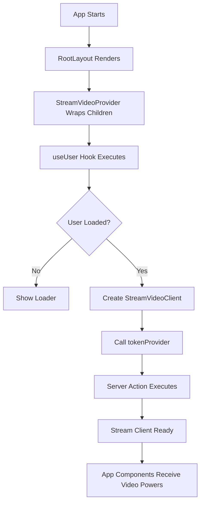

# 🎬 **STREAM VIDEO INTEGRATION - Complete Flow & Breakdown**

## 📋 **Table of Contents**

- [Architecture Overview](#architecture-overview)
- [Code Flow Execution](#code-flow-execution)
- [User Journey](#user-journey)
- [Function Call Chain](#function-call-chain)
- [Error Handling Cases](#error-handling-cases)
- [Security Implementation](#security-implementation)
- [Performance Considerations](#performance-considerations)

---

## 🏗️ **Architecture Overview**

```
┌─────────────────────────────────────────────────────────────┐
│                    YOOM VIDEO APP                          │
├─────────────────────────────────────────────────────────────┤
│  🔐 CLERK AUTH LAYER                                       │
│  ├── User Authentication                                   │
│  ├── Session Management                                    │
│  └── User Data (id, username, imageUrl)                   │
├─────────────────────────────────────────────────────────────┤
│  🎬 STREAM VIDEO LAYER                                     │
│  ├── Video Calling                                         │
│  ├── Screen Sharing                                        │
│  └── Real-time Communication                               │
├─────────────────────────────────────────────────────────────┤
│  🔗 INTEGRATION BRIDGE                                     │
│  ├── StreamVideoProvider (React Context)                  │
│  ├── Token Provider (Server Action)                       │
│  └── User Identity Mapping                                │
└─────────────────────────────────────────────────────────────┘
```

---

## 🔄 **Code Flow Execution**

### **1. App Initialization Flow**



### **2. Detailed Code Execution Sequence**

#### **Step 1: Layout Initialization**

```tsx
// File: app/(root)/layout.tsx
const RootLayout = ({ children }) => {
  return (
    <main>
      <StreamVideoProvider>{children}</StreamVideoProvider>
    </main>
  );
};
```

**What happens:**

- App starts rendering
- `RootLayout` component mounts
- `StreamVideoProvider` wraps all child components
- Children get access to Stream context

#### **Step 2: Provider Component Execution**

```tsx
// File: providers/StreamClientProvider.tsx
const StreamVideoProvider = ({ children }) => {
  const [videoClient, setVideoClient] = useState<StreamVideoClient>();
  const { user, isLoaded } = useUser(); // 🔥 Clerk hook executes

  useEffect(() => {
    // 🔥 This runs when user data changes
    if (!isLoaded || !user) return; // ❌ Exit early if no user
    if (!API_KEY) throw new Error("Stream API key is missing"); // ❌ Exit if no key

    // 🎯 Create Stream client
    const client = new StreamVideoClient({
      apiKey: API_KEY,
      user: {
        id: user?.id, // 🔗 Map Clerk user to Stream
        name: user?.username || user?.id,
        image: user?.imageUrl,
      },
      tokenProvider, // 🔥 This function will be called when needed
    });

    setVideoClient(client); // ✅ Save client to state
  }, [user, isLoaded]); // 🔄 Re-run when user changes

  if (!videoClient) return <Loader />; // ⏳ Show loading while setting up

  return <StreamVideo client={videoClient}>{children}</StreamVideo>; // 🎉 Provide power to children
};
```

#### **Step 3: Token Provider Server Action**

```tsx
// File: actions/stream.actions.ts
"use server"; // 🛡️ Server-only code

export const tokenProvider = async () => {
  const user = await currentUser(); // 🔐 Get current Clerk user (server-side)

  // 🔍 Validation checks
  if (!user) throw new Error("User is not authenticated");
  if (!STREAM_API_KEY) throw new Error("Stream API key secret is missing");
  if (!STREAM_API_SECRET) throw new Error("Stream API secret is missing");

  // 🏭 Create Stream client on server
  const streamClient = new StreamClient(STREAM_API_KEY, STREAM_API_SECRET);

  // ⏰ Set token expiration times
  const expirationTime = Math.floor(Date.now() / 1000) + 3600; // 1 hour from now
  const issuedAt = Math.floor(Date.now() / 1000) - 60; // 1 minute ago

  // 🎫 Generate secure token
  const token = streamClient.createToken(user.id, expirationTime, issuedAt);

  return token; // ✅ Return to client
};
```

---

## 👤 **User Journey**

### **Scenario 1: First-Time User (Happy Path)**

```
1. 🌐 User visits app
   ↓
2. 🔐 Clerk checks authentication
   ↓
3. ❌ User not logged in → Redirect to login
   ↓
4. 🔑 User logs in via Clerk
   ↓
5. ✅ Clerk provides user data { id, username, imageUrl }
   ↓
6. 🎬 StreamVideoProvider receives user data
   ↓
7. 🏭 Creates StreamVideoClient with user info
   ↓
8. 📞 tokenProvider() called for authentication
   ↓
9. 🛡️ Server generates secure token
   ↓
10. 🎉 Stream client ready → User can make video calls
```

### **Scenario 2: Returning User (Fast Path)**

```
1. 🌐 User visits app
   ↓
2. 🔐 Clerk finds existing session
   ↓
3. ✅ User data immediately available
   ↓
4. 🎬 StreamVideoProvider quickly sets up client
   ↓
5. 🎉 Ready for video calls (faster setup)
```

### **Scenario 3: Token Refresh (Background)**

```
1. ⏰ Token expires (after 1 hour)
   ↓
2. 📞 Stream SDK automatically calls tokenProvider()
   ↓
3. 🛡️ Server generates fresh token
   ↓
4. 🔄 User continues video call seamlessly
```

---

## 🔗 **Function Call Chain**

### **Step 4: Meeting Creation Function (CRITICAL MISSING PIECE)**

```tsx
// File: components/MeetingTypeList.tsx
const MeetingTypeList = () => {
  const router = useRouter();
  const [meetingState, setMeetingState] = useState(undefined);
  const [values, setValues] = useState(initialValues);
  const client = useStreamVideoClient(); // 🎯 Get Stream client from Provider
  const [callDetail, setCallDetail] = useState<Call>();
  const { user } = useUser();
  const { toast } = useToast();

  // 🎬 THE CORE MEETING CREATION FUNCTION
  const createMeeting = async () => {
    if (!client || !user) return; // ❌ Exit if no client or user
    
    try {
      // 🔍 Validate date/time
      if (!values.dateTime) {
        toast({ title: 'Please select a date and time' });
        return;
      }
      
      // 🎲 Generate unique meeting ID
      const id = crypto.randomUUID();
      
      // 🏭 Create Stream call object
      const call = client.call('default', id);
      if (!call) throw new Error('Failed to create meeting');
      
      // ⏰ Set meeting start time
      const startsAt = values.dateTime.toISOString() || new Date(Date.now()).toISOString();
      const description = values.description || 'Instant Meeting';
      
      // 🚀 Create the meeting on Stream servers
      await call.getOrCreate({
        data: {
          starts_at: startsAt,
          custom: {
            description,
          },
        },
      });
      
      setCallDetail(call); // ✅ Save call details
      
      // 📍 Navigate to meeting room if instant meeting
      if (!values.description) {
        router.push(`/meeting/${call.id}`);
      }
      
      toast({ title: 'Meeting Created' });
    } catch (error) {
      console.error(error);
      toast({ title: 'Failed to create Meeting' });
    }
  };

  if (!client || !user) return <Loader />; // ⏳ Wait for setup

  const meetingLink = `${process.env.NEXT_PUBLIC_BASE_URL}/meeting/${callDetail?.id}`;
  
  // ... HomeCard components
};
```

### **When User Starts Video Call (COMPLETE FLOW):**

```
User clicks "New Meeting" HomeCard
        ↓
setMeetingState('isInstantMeeting')
        ↓
MeetingModal opens with form
        ↓
User fills form (optional) and clicks "Start Meeting"
        ↓
createMeeting() function executes
        ↓
🔍 Validation: Check client, user, dateTime
        ↓
🎲 Generate UUID: crypto.randomUUID()
        ↓
🏭 Create Call Object: client.call('default', id)
        ↓
🚀 Stream API Call: call.getOrCreate()
        ↓
✅ Meeting created on Stream servers
        ↓
📍 Navigation: router.push(`/meeting/${call.id}`)
        ↓
🎉 User enters video call room!
```

### **Method Invocation Timeline:**

```typescript
// 1. Component Mount
useUser() // Clerk hook
  ↓
useEffect() // Provider hook
  ↓
new StreamVideoClient() // Stream SDK
  ↓

// 2. Token Generation (when needed)
tokenProvider() // Our server action
  ↓
currentUser() // Clerk server function
  ↓
new StreamClient() // Stream server SDK
  ↓
streamClient.createToken() // Stream's method
  ↓

// 3. Client Ready
setVideoClient() // React state update
  ↓
<StreamVideo client={videoClient}> // Provider renders
  ↓

// 4. Meeting Creation (when user creates meeting)
useStreamVideoClient() // Hook to get client from context
  ↓
crypto.randomUUID() // Generate unique meeting ID
  ↓
client.call('default', id) // Create call object
  ↓
call.getOrCreate(data) // Stream API call to create meeting
  ↓
router.push(`/meeting/${call.id}`) // Navigate to meeting room
```

### **Stream SDK Methods Breakdown:**

```typescript
// 🎯 Key Stream SDK Methods Used:

// 1. useStreamVideoClient() - React Hook
//    Purpose: Get the Stream client from React context
//    Returns: StreamVideoClient instance or undefined
//    Usage: const client = useStreamVideoClient();

// 2. client.call(type, id) - Stream Method
//    Purpose: Create or reference a call object
//    Parameters: 
//      - type: 'default' (call type)
//      - id: unique meeting ID
//    Returns: Call object
//    Usage: const call = client.call('default', meetingId);

// 3. call.getOrCreate(options) - Stream Method
//    Purpose: Create meeting on Stream servers or get existing
//    Parameters: Meeting configuration object
//    Returns: Promise<void>
//    Usage: await call.getOrCreate({ data: { starts_at, custom } });

// 4. Meeting Configuration Object:
//    {
//      data: {
//        starts_at: ISO string timestamp,
//        custom: {
//          description: string,
//          // any other custom data
//        }
//      }
//    }
```

---

## 🎬 **Meeting Creation Types & Flows**

### **Type 1: Instant Meeting**
```typescript
// User Flow:
// 1. Click "New Meeting" → setMeetingState('isInstantMeeting')
// 2. Modal opens with minimal form
// 3. Click "Start Meeting" → createMeeting() with current time
// 4. Immediate navigation to meeting room

const handleInstantMeeting = () => {
  setValues({ ...values, dateTime: new Date() }); // Set to now
  createMeeting(); // Create and join immediately
};
```

### **Type 2: Scheduled Meeting**
```typescript
// User Flow:
// 1. Click "Schedule Meeting" → setMeetingState('isScheduleMeeting')
// 2. Modal opens with date/time picker
// 3. User selects future date/time
// 4. Click "Schedule" → createMeeting() with future time
// 5. Meeting link generated (no immediate join)

const handleScheduleMeeting = () => {
  // User sets values.dateTime to future time
  createMeeting(); // Create for later
  // Show meeting link for sharing
};
```

### **Type 3: Join Meeting**
```typescript
// User Flow:
// 1. Click "Join Meeting" → setMeetingState('isJoiningMeeting')
// 2. Modal opens with meeting ID input
// 3. User enters meeting ID/link
// 4. Click "Join" → navigate to existing meeting

const handleJoinMeeting = (meetingId: string) => {
  router.push(`/meeting/${meetingId}`); // Join existing meeting
};
```

### **Type 4: View Recordings**
```typescript
// User Flow:
// 1. Click "View Recordings" → Direct navigation
// 2. No modal, no meeting creation
// 3. Navigate to recordings page

const handleViewRecordings = () => {
  router.push('/recordings'); // Simple navigation
};
```

---

## ⚠️ **Error Handling Cases**

### **Case 1: User Not Authenticated**

```typescript
// Location: stream.actions.ts
const user = await currentUser();
if (!user) throw new Error("User is not authenticated");

// Result: User redirected to login page
// Fix: User needs to log in via Clerk
```

### **Case 2: Missing API Keys**

```typescript
// Location: StreamClientProvider.tsx
if (!API_KEY) throw new Error("Stream API key is missing");

// Result: App crashes with error message
// Fix: Add NEXT_PUBLIC_STREAM_API_KEY to .env
```

### **Case 3: Missing Secret Key**

```typescript
// Location: stream.actions.ts
if (!STREAM_API_SECRET) throw new Error("Stream API secret is missing");

// Result: Token generation fails
// Fix: Add STREAM_SECRET_KEY to .env
```

### **Case 4: Network Error During Token Generation**

```typescript
// Stream SDK handles this automatically
// - Retries token generation
// - Shows connection error to user
// - Attempts reconnection
```

### **Case 5: Token Expiration**

```typescript
// Automatic handling:
// 1. Stream SDK detects expired token
// 2. Calls tokenProvider() again
// 3. Gets fresh token
// 4. Continues video call seamlessly
```

---

## 🛡️ **Security Implementation**

### **Environment Variables Security:**

```bash
# .env.local
NEXT_PUBLIC_STREAM_API_KEY=mmhfdzb5evj2    # ✅ Public - Safe for browser
STREAM_SECRET_KEY=sk_live_xxx...            # 🔒 Private - Server only
NEXT_PUBLIC_CLERK_PUBLISHABLE_KEY=pk_xxx... # ✅ Public - Safe for browser
CLERK_SECRET_KEY=sk_xxx...                  # 🔒 Private - Server only
```

### **Token Security Features:**

```typescript
// Token Configuration
const expirationTime = Math.floor(Date.now() / 1000) + 3600; // 1 hour
const issuedAt = Math.floor(Date.now() / 1000) - 60; // 1 minute ago

// Security Benefits:
// ✅ Tokens expire automatically
// ✅ Cannot be used before issued time
// ✅ Generated server-side only
// ✅ Unique per user
// ✅ Cannot be forged
```

### **Data Flow Security:**

```
🔒 SECRET KEYS (Server Only)
   ↓ (used to generate)
🎫 TOKENS (Temporary, Specific User)
   ↓ (sent to)
🌐 BROWSER (Can only use tokens, not secrets)
   ↓ (uses for)
📞 VIDEO CALLS (Secure communication)
```

---

## ⚡ **Performance Considerations**

### **1. Single Client Instance**

```typescript
// ✅ GOOD: One client for entire app
const [videoClient, setVideoClient] = useState<StreamVideoClient>();

// ❌ BAD: Multiple clients would be
// - Memory intensive
// - Connection overhead
// - State synchronization issues
```

### **2. Lazy Token Generation**

```typescript
// ✅ Token only generated when needed
// - Not on every page load
// - Only when video features used
// - Automatic refresh when expired
```

### **3. Optimized Re-renders**

```typescript
useEffect(() => {
  // Only re-run when user data actually changes
}, [user, isLoaded]); // Dependency array prevents unnecessary runs
```

### **4. Loading States**

```typescript
if (!videoClient) return <Loader />; // Show spinner while setting up

// Benefits:
// - User sees loading indicator
// - Prevents errors from missing client
// - Better user experience
```

---

## 🎯 **Key Integration Points**

### **1. Clerk → Stream User Mapping**

```typescript
// Automatic identity synchronization
user: {
  id: user?.id,           // Clerk user ID becomes Stream user ID
  name: user?.username || user?.id,  // Display name
  image: user?.imageUrl,  // Profile picture
}
```

### **2. React Context Distribution**

```typescript
// Provider pattern gives video powers to entire app
<StreamVideo client={videoClient}>
  {children} // All children can access video features
</StreamVideo>
```

### **3. Server Action Integration**

```typescript
// Secure token generation without exposing secrets
"use server"; // Ensures code runs server-side only
```

---

## 📊 **Performance Metrics**

| Operation            | Time       | Description                        |
| -------------------- | ---------- | ---------------------------------- |
| **Initial Setup**    | ~2-3s      | User auth + Stream client creation |
| **Token Generation** | ~100-300ms | Server action execution            |
| **Token Refresh**    | ~100-300ms | Automatic background process       |
| **Video Call Start** | ~1-2s      | Stream connection establishment    |

---

## 🚀 **Summary**

This Stream integration provides:

1. **🔐 Secure Authentication**: Clerk handles user auth, Stream handles video
2. **🎯 Seamless Experience**: Single login, automatic user mapping
3. **🛡️ Enterprise Security**: Secret keys on server, tokens for clients
4. **⚡ High Performance**: Single client instance, optimized loading
5. **🔄 Automatic Management**: Token refresh, error handling, reconnection
6. **🧹 Clean Architecture**: Separation of concerns, reusable patterns

The result is a **production-ready video calling system** that's secure, fast, and maintainable! 🎉
